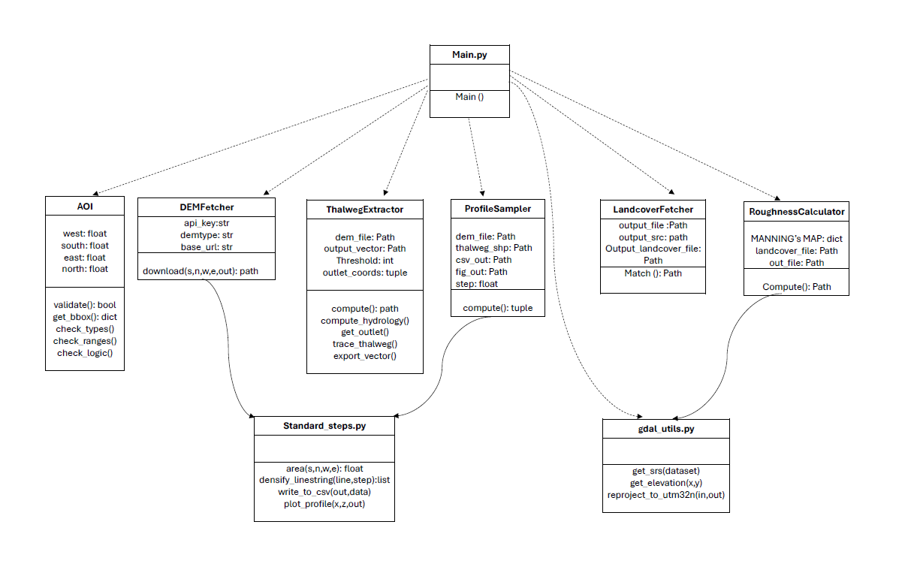

# Terrain Analysis Tool 
This tool is a python based application that carries out Terrain Analysis, 
by using DEM and Landcover data for southern Germany obtained from Open sources. 
It outputs datasets(such as Terrain Roughness and Thalweg) that have several 
applications in numerous fields in the real world. 

## Motivation 
Traditional GIS software like QGIS is powerful but relies on manual,click-heavy
workflows that are difficult to scale or replicate exactly. This tool replaces 
those manual steps with a single, reproducible command-line interface that 
automates data fetching and terrain processing.It eliminates human error and allows
for the rapid processing of multiple study sites.

## Goals 
The goal of this tool is to produce a code that automatically downloads a DEM
clipped to a bounding box from an open source and retrieves a land cover raster
for the same extent.Then processes it to produce a Roughness Raster and Extracts
the Thalweg as a polyline and samples a longitudinal profile along it.

## Usage Instruction 
The following steps should be followed to run the tool:
1. Clone the repository
2. Open the project in your IDE of choice (PyCharm)
3. Set Python 3.11.10 as the Python Interpreter
4. Open the terminal and run `pip install -r requirements.txt`, or any method to install dependencies
6. Click "Run Script"
7. The Command line Interface will prompt you for the Bounding Box coordinates,
press enter if you want to run with our sample data or input new coordinates. 

A landcover raster from ESA world landcover website for southern Germany region is already available in the Data folder.
if you want to carry out assessment for other parts of germany or the world make sure a landcover raster is downloaded and saved in the same folder.

Our Sample AOI is a 92 km² area around the River Neckar in the "Remseck am Neckar - Bad-Canstatt" Region

The outputs are as follows:

 - dem_wgs84_utm32n.tff    This a GeoTIFF image of the DEM clipped to AOI with coordinate units transformation.  
 - Landcover_matched.tiff  This a GeoTIFF image of the Landcover Raster clipped to AOI with coordinate units transformation.  
 - Roughness.tif           This a GeoTIFF image of the Roughness Map with Manning´s n computed corresponding to landcover type     
 - Thalweg.shp             This is a single polyline that represents the deepest part of the river channel.
 - thalweg_profile.png     This is a plot of the elevation along the length of the thalweg 
 - thalweg_profile.csv     A csv file that contains information with distance_m, lon, lat, elevation_m

## Requirements
### Standard API and Data Handling
requests==3.32.5
numpy~=1.26.4

### Geospatial Processing
rasterio~=1.4.4
gdal==3.11.4
pysheds==0.5
geopandas==1.1.2
shapely==2.1.2
pandas==3.0.0

### Visualization
matplotlib==3.10.8

## Code Diagram 
The following UML provides a general flowchart of how the tool operates, and how each script plays a role in the tool

## Function and Class Documentation 
[Function and Class Documentation ](function_docs.md)