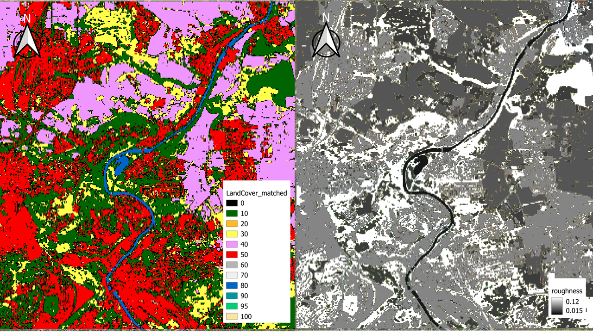
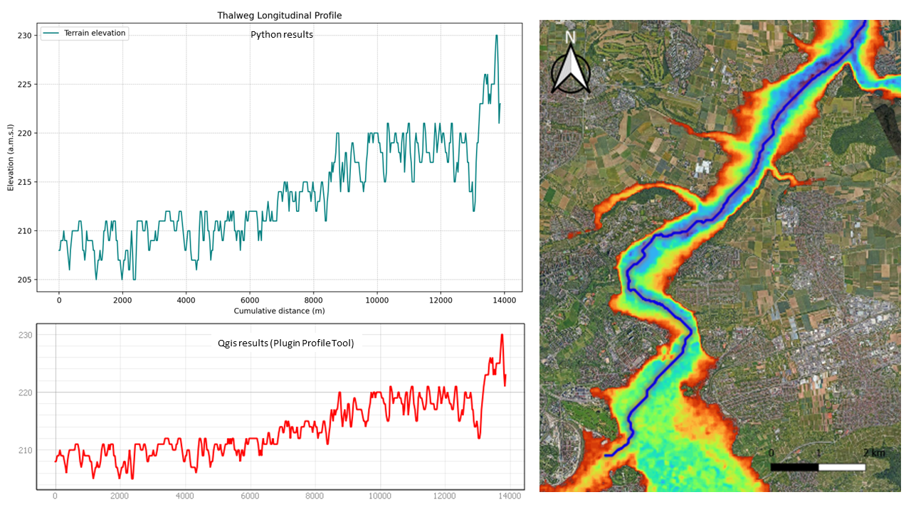

## Results Analysis in QGIS 

The results obtained were layered onto Google Satellite Imagery for visualisation and to check for consistency of reprojection. 
the following figures were generated: 

figure 1: DEM clipped to AOI and layered over Google Maps. 
The DEM CRS and values were validated and from the visualisation the values 
for elevation looks realistic with darker region corresponding to the drainage path of the river.  

figure 2: LandCover and Roughness raster clipped to AOI and layered over Google Maps. 
The Landcover Raster retrieved and Roughness computed from it  is visually corresponding to the AOI.

figure 3: Thalweg fitted in the DEM clipped to AOI and layered over Google Maps. 
The thalweg was fitted into the DEM layer and appears to follow in the drainage path of the DEM. 

figure 4: Thalweg and profile comparison. 

## Discussion 

 The downloaded DEM from Open Topography source clipped to the AOI was converted to EPSG:32632 - WGS 84 / UTM zone 32N
 so that the units are in meters which is required in order to be able to carry out further processing 
 to obtain meaningful data.

 The Landcover Raster from ESA World Cover was retrieved for the same extent.In the landcover map,Nearest neighbour resampling
 (resampleAlg="near") was used when warping the land cover raster because land cover is categorical data composed of 
 discrete class labels (e.g., forest, urban, grassland). Unlike continuous variables such as elevation, these class values
 do not represent measurable quantities and therefore must not be interpolated.

The roughness is computed using a direct reclassification method. It doesn't use a physical formula or calculation;
 instead, it performs a 1-to-1 mapping between land cover types and static Manning's n values that was obtained from literature Review.
 
The DEM raster was preprocessed using Pysheds to fill in pits and resolve plats to ensure hydrological connectivity
when extracting the thalweg. The using D8 routing the direction of flow was determined (steepest descent method) from the 
neighbouring cells.Then the accumulation to each cells was computed and then using a threshold was used to define the flow streams.
A high value of 5000 was used as threshold
the cell with the maximum accumulation was selected as the outlet and reverse dir was used to trace back the thalweg. 
if we look at the thalweg obtained however the following concerns were identified: 
1. The thalweg upstream deviates significantly from the main drainage channel and goes up a minor drainage path :
this is because we are using a clipped DEM and there is limited information about what lies beyond this boundary
its being treated as a no flow boundary.This is one of the limitations of a clipped DEM.tif usually to obtain a more accurate
and realistic flow path the catchment should be used instead or the upstream coordinates if know should be input to 
force the thalweg to move in that direction
2. TThe  DEM resolution was of 30 m and that is not accurate enough to extract the thalweg as it leads to a scale mismatch 
between the resolution and the river size. The DEM averages the deepest depth of the river with that of the surrounding 
floodplains. Thus the extracted thalweg may shift away from the actual position of the thalweg. This results in a 
jagged thalweg instead of a smoother line. When we tried  to resample the DEM to 10 m to match that of the landcover 
or adjust the threshold to influence the thalweg we ended with worse extraction than before. So we concluded that
a high resolution DEM of 1 m should be used instead for accurate results. 

The profile is sampled along the thalweg, therefore errors that occurs in the thalweg are reflected in the profile plot.
As we can observe from the plot the graphs is very noisy which is a consequence of the jagged thalweg and near the upstream 
we observe a sharp increase in elevation which corresponds to the deviation from the actual channel near the clipped boundary.

